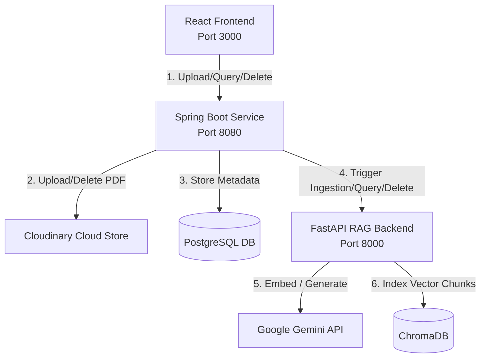

# RAG Policy Query System

A production-ready Retrieval-Augmented Generation (RAG) system to upload PDF policy documents, index them, and ask natural language questions with source page references.

---

## 1. System Architecture

The application is built on a decoupled, three-tier microservice architecture:



### Flow of Operations

1. **Upload Document (`POST /documents`)**:
   * **React** uploads a PDF file to the **Spring Boot** service.
   * **Spring Boot** uploads the PDF to **Cloudinary** and saves the document metadata in **PostgreSQL**.
   * **Spring Boot** calls **FastAPI** (`POST /ingest`) with the document ID and public Cloudinary URL.
   * **FastAPI** downloads the PDF, chunks it semantically, generates vector embeddings, and stores them in **ChromaDB**.

2. **Ask Question (`POST /query`)**:
   * **React** sends the selected document ID and a question to **Spring Boot**.
   * **Spring Boot** validates the document existence and calls **FastAPI** (`POST /rag/query`).
   * **FastAPI** runs a hybrid BM25 + Vector search on **ChromaDB** filtered by the document ID.
   * Context chunks and the question are sent to the **Gemini API** (`gemini-2.5-flash`) to generate a factual answer.
   * The answer and source snippets (with page numbers) are returned back to the frontend.

3. **Delete Document (`DELETE /documents/{id}`)**:
   * **Spring Boot** deletes the PDF from **Cloudinary** and metadata from **PostgreSQL**.
   * **Spring Boot** calls **FastAPI** to delete all associated vector chunks from **ChromaDB**.

---

## 2. Resolving the 512MB RAM Render Limit

Render's free tier imposes a strict **512MB memory limit**, which initially caused deployment startup crashes (`Out of memory (used over 512Mi)`). We solved this using three engineering optimizations:

### A. Switched from Local to API-Based Embeddings
* **Before:** The system loaded a local HuggingFace `all-MiniLM-L6-v2` embeddings model using `langchain-huggingface` and `sentence-transformers`. This forced Python to load **PyTorch (`torch`)** and local model binaries, consuming **350MB+ RAM** at startup.
* **Solution:** We replaced it with Google's API-based **`GoogleGenAIEmbeddings`** (`models/text-embedding-004`).
* **Result:** Embedding calculation is delegated to Google's cloud API over HTTP. PyTorch, sentence-transformers, and model binaries were completely removed from the environment, **saving ~300MB+ RAM**.

### B. Lazy Resource Loading
* **Before:** The Gemini LLM connection and LangChain LCEL RAG chain were initialized globally at import/startup time.
* **Solution:** We wrapped these components in getter functions (`get_llm()` and `get_chain()`) that are only called when the first API request is received.
* **Result:** FastAPI starts instantly with a clean, low-memory profile, avoiding connection overhead at boot time.

### C. Cleaned Dependencies
* Removed heavy libraries from [requirements.txt](file:///c:/Users/mudit/Desktop/RAG_proj/rag_app/requirements.txt), resulting in a 75% smaller Docker/PIP footprint and faster builds on Render.

---

## 3. How to Run Locally

### A. Run FastAPI RAG Backend
1. Make sure you have your `GEMINI_API_KEY` set in `rag_app/.env`.
2. Run:
   ```bash
   cd rag_app
   .\ragenv\Scripts\python.exe main.py
   ```

### B. Run Spring Boot Orchestrator
1. Make sure database and Cloudinary keys are set in `application-local.properties`.
2. Run:
   ```bash
   cd rag_backend_springboot/backend/backend
   .\mvnw spring-boot:run -Dspring-boot.run.profiles=local
   ```

### C. Run React Frontend
1. Start the React development server:
   ```bash
   cd react_frontend/rag-query
   npm start
   ```
